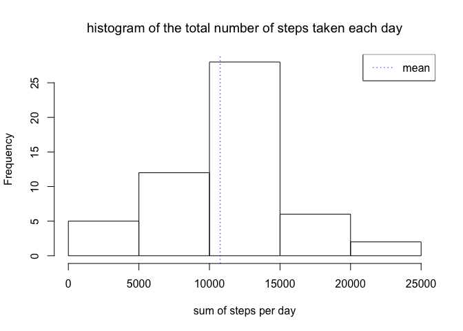
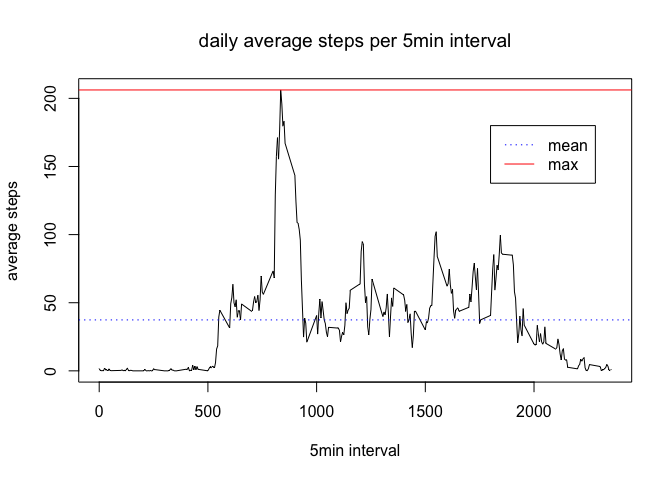
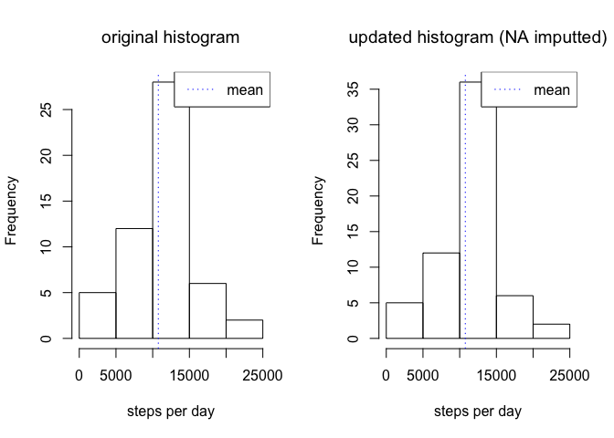
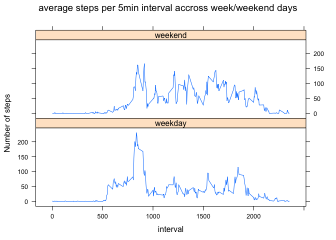

## Loading and preprocessing the data
Checking structure after unzipping and reading the file (with correct classes)

```r
unzip("activity.zip")
mdata <- read.csv("activity.csv", colClasses=c("numeric","Date","numeric"))
str(mdata) ; summary(mdata)
```

```
## 'data.frame':	17568 obs. of  3 variables:
##  $ steps   : num  NA NA NA NA NA NA NA NA NA NA ...
##  $ date    : Date, format: "2012-10-01" "2012-10-01" ...
##  $ interval: num  0 5 10 15 20 25 30 35 40 45 ...
```

```
##      steps             date               interval     
##  Min.   :  0.00   Min.   :2012-10-01   Min.   :   0.0  
##  1st Qu.:  0.00   1st Qu.:2012-10-16   1st Qu.: 588.8  
##  Median :  0.00   Median :2012-10-31   Median :1177.5  
##  Mean   : 37.38   Mean   :2012-10-31   Mean   :1177.5  
##  3rd Qu.: 12.00   3rd Qu.:2012-11-15   3rd Qu.:1766.2  
##  Max.   :806.00   Max.   :2012-11-30   Max.   :2355.0  
##  NA's   :2304
```


## What is mean total number of steps taken per day?
1. Computing the sum of steps per day (in a dataframe using dplyr)  

```r
library(dplyr)
# grouping by date then computing the total
steps_day <- mdata %>% group_by(date) %>% summarize(sumSteps=sum(steps))
```

2. Computing total number of steps **mean** and **median**

```r
mean(steps_day$sumSteps, na.rm=TRUE)
```

```
## [1] 10766.19
```

```r
median(steps_day$sumSteps, na.rm=TRUE)
```

```
## [1] 10765
```

3. Printing histogram of total number of steps taken each day

```r
hist(steps_day$sumSteps,
     main="histogram of the total number of steps taken each day",
     xlab="sum of steps per day")
# optionnaly printing the average of steps per day
abline(v=mean(steps_day$sumSteps, na.rm=T), lty=3, col="blue")
legend("topright", legend="mean", col="blue", lty=3)
```

<!-- -->


## What is the average daily activity pattern?
Using dplyr again but grouping by intervals, we build the required plot  

```r
# grouping by interval then computing the average
steps_interval_avg <- mdata %>%
    group_by(interval) %>%
    summarize(meanSteps=mean(steps, na.rm=T))
plot(steps_interval_avg$meanSteps, type='l',
     main="daily average steps per 5min interval",
     xlab="interval index",
     ylab="average steps")
# optionnaly printing the max and average values as lines
abline(h=mean(steps_interval_avg$meanSteps, na.rm=T), lty=3, col="blue")
abline(h=max(steps_interval_avg$meanSteps), lty=1, col="red")
legend(x=210, y=180, legend=c("mean","max"), col=c("blue","red"), lty=c(3,1))
```

<!-- -->

Following is the index and value of the 5-minute interval containing the maximum
number of steps (on average across all the days in the dataset):  

```r
which.max(steps_interval_avg$meanSteps)
```

```
## [1] 104
```

```r
max(steps_interval_avg$meanSteps)
```

```
## [1] 206.1698
```


## Imputing missing values
Checking how many observations are incomplete (_'FALSE'_ in the table below)

```r
table(complete.cases(mdata))
```

```
## 
## FALSE  TRUE 
##  2304 15264
```

Creating new dataset `mdata2` with missing values imputed with interval average
across all day (previsouly computed)

```r
mdata2 <- mdata
# parsing dataset looking for missing values...
for (i in 1:nrow(mdata2))
    if (is.na(mdata2$steps[i])) {
        # retrieving interval index in steps_interval_steps_mean
        mean_interval_idx <- steps_interval_avg$interval == mdata2$interval[i]
        # imputting na by corresponding steps_interval_avg
        mdata2$steps[i] <- steps_interval_avg$meanSteps[mean_interval_idx]
    }
```

Checking that imputed values **did not** impact dataset mean and median values

```r
# checking there is no more NA and that mean and median values did not change
summary(mdata2)
```

```
##      steps             date               interval     
##  Min.   :  0.00   Min.   :2012-10-01   Min.   :   0.0  
##  1st Qu.:  0.00   1st Qu.:2012-10-16   1st Qu.: 588.8  
##  Median :  0.00   Median :2012-10-31   Median :1177.5  
##  Mean   : 37.38   Mean   :2012-10-31   Mean   :1177.5  
##  3rd Qu.: 27.00   3rd Qu.:2012-11-15   3rd Qu.:1766.2  
##  Max.   :806.00   Max.   :2012-11-30   Max.   :2355.0
```

Checking that even if totals changed a bit, the plot global shape **has not**

```r
# recomputing first step and displaying the plot
steps_day2 <- mdata2 %>% group_by(date) %>% summarize(sumSteps=sum(steps))
hist(steps_day2$sumSteps,
     main="updated histogram of steps taken each day",
     xlab="sum of steps per day")
# optionnaly printing (again) that should be identical)
abline(v=mean(steps_day$sumSteps, na.rm=T), lty=3, col="blue")
legend("topright", legend="mean", col="blue", lty=3)
```

<!-- -->


## Are there differences in activity patterns between weekdays and weekends?
First, adding a new factor variable for weekend / weekday classification

```r
weekend=c("Saturday", "Sunday")
mdata2 <- mdata2 %>%
    mutate(weekday=ifelse(weekdays(date) %in% weekend, "weekend", "weekday"))
```

Using Lattice to build plot displaying diff between week and weekend activity

```r
# grouping data per  interval AND day type (weekday) this time
steps_interval_avg2 <- mdata2 %>%
    group_by(weekday, interval) %>% summarize(meanSteps=mean(steps))
library(lattice)
xyplot(meanSteps ~ interval | weekday, data=steps_interval_avg2, type='l',
       layout=c(1,2), ylab="Number of steps",
       main="average steps per 5min interval accross week/weekend days")
```

<!-- -->


